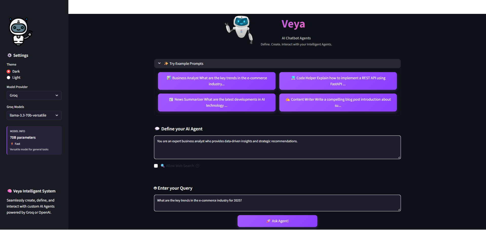

# 🎯 Veya - Intelligent Agentic AI Chatbot

Veya is an intelligent AI chatbot system that lets you create and customize AI agents powered by Groq and OpenAI models, with integrated web search via Tavily for real-time information retrieval.
## 📸 Screenshots

<div align="center">
  
</div>

## ✨ Key Features

- 🎨 **Customizable AI Agents** - Define system prompts to create specialized agents
- ⚡ **Multiple LLM Support** - Groq (Llama 3.3, Mixtral) and OpenAI (GPT-4o-mini)
- 🔍 **Web Search Integration** - Real-time information via Tavily Search
- 🎭 **Dark/Light Theme** - Modern, responsive UI
- 💬 **Example Prompts** - Business Analyst, Code Helper, News Summarizer, Content Writer


## 🛠️ Tech Stack

**Frontend:** Streamlit, Python 3.13  
**Backend:** FastAPI, Uvicorn  
**AI/ML:** LangChain, LangGraph, Groq, OpenAI, Tavily Search

## 🚀 Quick Start

### Prerequisites
- Python 3.13+
- API Keys: [Groq](https://console.groq.com), [OpenAI](https://platform.openai.com), [Tavily](https://tavily.com)

### Installation

1. **Clone the repository**
```bash
git clone https://github.com/yourusername/veya-chatbot.git
cd veya-chatbot
```

2. **Install dependencies**
```bash
pip install -r requirements.txt
```

3. **Set up environment variables**
Create a `.env` file:
```env
GROQ_API_KEY=your_groq_api_key
OPENAI_API_KEY=your_openai_api_key
TAVILY_API_KEY=your_tavily_api_key
```

4. **Run the backend**
```bash
python backend.py
```

5. **Run the frontend** (new terminal)
```bash
streamlit run streamlit_app/frontend.py
```

6. **Access the app**
- Frontend: http://localhost:8501
- Backend API: http://localhost:9999

## 📁 Project Structure

```
AGENTIC_CHATBOT_FASTAPI/
├── streamlit_app/
│   ├── frontend.py              
│   └── requirements.txt
├── ai_agent.py                  
├── backend.py                   
├── requirements.txt
└── .env                         
```

## 📡 API Usage

**Endpoint:** `POST /chat`

```json
{
  "model_name": "llama-3.3-70b-versatile",
  "model_provider": "Groq",
  "system_prompt": "You are a helpful assistant...",
  "messages": ["Your query here"],
  "allow_search": true
}
```

## 🌐 Deployment

**Live Application:**
- Frontend: https://veya-agentic-chatbot.streamlit.app/
- Backend: https://agentic-chatbot-fastapi-k9jt.onrender.com/
## 🤝 Contributing

Contributions are welcome! Please:
1. Fork the project
2. Create your feature branch (`git checkout -b feature/AmazingFeature`)
3. Commit your changes (`git commit -m 'Add AmazingFeature'`)
4. Push to the branch (`git push origin feature/AmazingFeature`)
5. Open a Pull Request

## 🚧 Future Enhancements

- 💾 **Conversation History** - Save and retrieve past chat sessions
- 👥 **Multi-Agent Collaboration** - Multiple agents working together on complex tasks
- 🔌 **Plugin System** - Extensible architecture for custom tools and integrations
- 📊 **Analytics Dashboard** - Track usage, token consumption, and agent performance
- 🎙️ **Voice Input/Output** - Speech-to-text and text-to-speech capabilities
- 📄 **Document Processing** - Upload and analyze PDFs, Word docs, and spreadsheets
- 🔄 **Agent Marketplace** - Share and discover pre-configured agents
- 🧠 **Memory System** - Long-term memory for personalized interactions
- 🌍 **Multi-language Support** - Support for multiple languages beyond English
- 🔐 **User Authentication** - Secure login and personalized agent configurations

## 🙏 Acknowledgments

Built with [LangChain](https://langchain.com), [Groq](https://groq.com), [OpenAI](https://openai.com), [Tavily](https://tavily.com), [Streamlit](https://streamlit.io), and [FastAPI](https://fastapi.tiangolo.com).

---

<div align="center">
⭐ Star this repository if you find it helpful!
</div>
